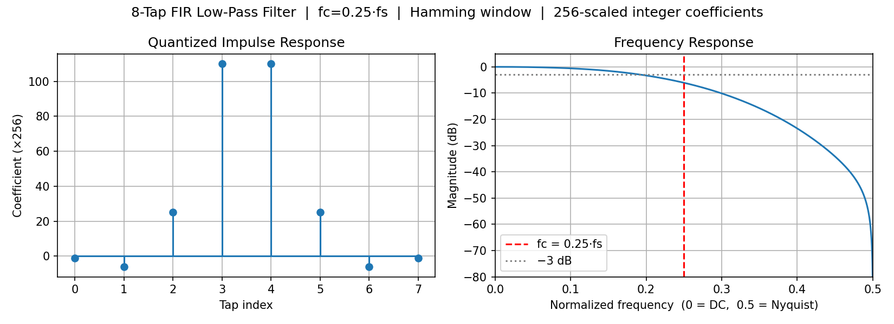
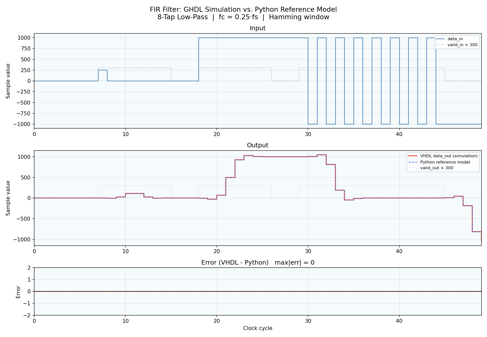
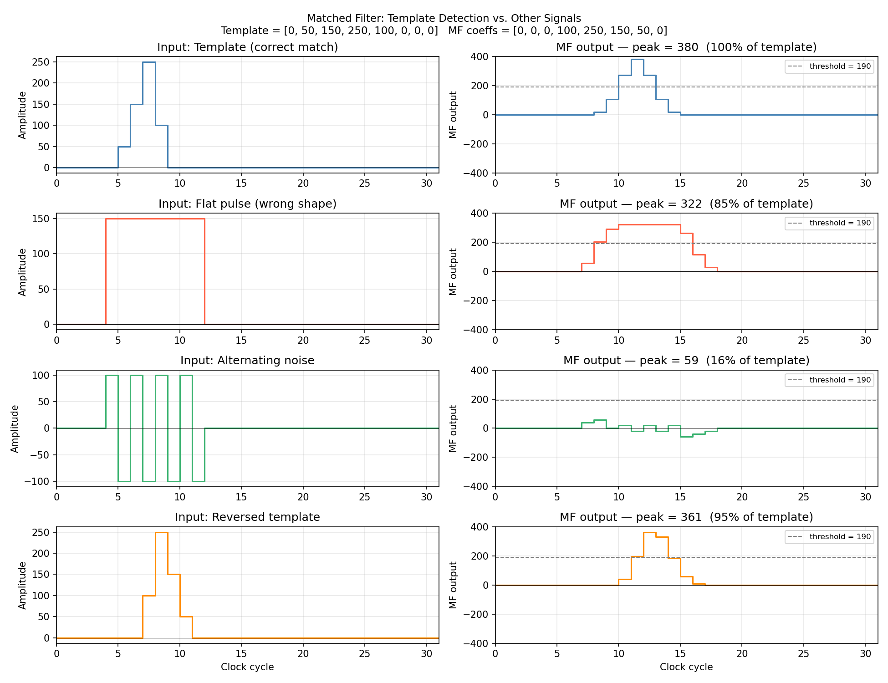

# FPGA DSP Demo — Fixed-Point Signal Processing Pipeline in VHDL

A portfolio project for fixed-point digital signal processing on FPGAs.
VHDL design, self-checking testbenches, Python coefficient design, and
verified simulation vs. software reference model.



---

## Pipeline Overview

```
                                             +--> [ Threshold Detector ] --> detected
                                             |         (Stage 2a)
data_in --> [ FIR Low-Pass Filter ] --> filtered_out
                 (Stage 1)                   |
                                             +--> [ Peak Detector ] --> peak_val, peak_pos
                                                      (Stage 2b)

data_in --> [ Matched Filter ] --> corr_out --> (feed into peak detector to locate template)
                 (Stage 3)
```

The filter removes high-frequency noise first.  The two detector stages then
operate on the clean signal independently:
- **Threshold Detector** — answers *"is there a signal right now?"* (one bit per cycle)
- **Peak Detector** — answers *"where was the maximum, and how large was it?"* (once per event)
- **Matched Filter** — answers *"does the input contain this specific waveform?"* (correlation peak)

---

## Results

### FIR Filter: GHDL Simulation vs. Python Reference Model

The Python integer model and the GHDL simulation produce **identical output
on every cycle** (max|error| = 0).



| Test | Input | Expected output | Result |
|------|-------|-----------------|--------|
| Impulse response | x[0]=256, rest=0 | Coefficients `[-1,-6,25,110,110,25,-6,-1]` | PASS |
| DC steady-state | constant 1000 | 1000 (unity DC gain) | PASS |
| Nyquist rejection | alternating +-1000 | 0 (complete rejection) | PASS |

### Pipeline: Threshold Detector Tests

| Test | Input | Filter output | detected | Result |
|------|-------|---------------|----------|--------|
| Silence | 0 | 0 | 0 | PASS |
| Weak DC (200 < 500) | 200 | 200 | 0 | PASS |
| Strong DC (1000 > 500) | 1000 | 1000 | 1 | PASS |
| Nyquist noise (raw 1000, filtered 0) | +-1000 | 0 | 0 | PASS |

The last test is the key demonstration: a raw amplitude of 1000 would trigger
the detector directly, but the FIR filter suppresses it to 0 first.

### Peak Detector Tests

| Test | Input pulse | Expected peak_val | Expected peak_pos | Result |
|------|-------------|-------------------|-------------------|--------|
| Positive peak | 0, 600, 800, **1000**, 700, 400 | 1000 | 2 | PASS |
| Negative peak | 0, -600, -800, **-1000**, -700, -400 | -1000 | 2 | PASS |
| Below threshold | 100, 300, 490, 300, 100 | — | — | PASS (no detection) |
| Two pulses (A then B) | pulse 1000 then pulse 900 | 1000 / 900 | 1 / 1 | PASS |

### Matched Filter Tests

Template: `T = [0, 50, 150, 250, 100, 0, 0, 0]`
MF coefficients (time-reversed): `h = [0, 0, 0, 100, 250, 150, 50, 0]`
Signal energy = 97 500 → expected peak = 97500 >> 8 = **380**



| Test | Input | Peak MF output | % of template | Result |
|------|-------|----------------|---------------|--------|
| Template (exact match) | T = [0,50,150,250,100,0,0,0] | **380** | 100% | PASS |
| Flat pulse | 150 × 8 samples | 322 | 84.7% | PASS |
| Alternating noise | [100,-100,...] × 8 | 59 | 15.5% | PASS |
| Reversed template | T reversed | 361 | 95.0% | PASS |

The alternating-noise result (15.5%) demonstrates the core property of a
matched filter: signals that do not resemble the template are strongly
suppressed in the correlation output.

---

## Project Structure

```
fpga-dsp-demo/
├── rtl/
│   ├── fir_filter.vhd           # Generic FIR low-pass filter (Stage 1)
│   ├── threshold_detector.vhd   # Amplitude threshold detector (Stage 2a)
│   ├── peak_detector.vhd        # Peak finder with state machine (Stage 2b)
│   ├── matched_filter.vhd       # Matched filter / correlator (Stage 3)
│   └── dsp_pipeline.vhd         # Top-level: connects filter + threshold detector
├── tb/
│   ├── tb_fir_filter.vhd        # FIR self-checking testbench
│   ├── tb_dsp_pipeline.vhd      # Pipeline self-checking testbench
│   ├── tb_peak_detector.vhd     # Peak detector self-checking testbench
│   └── tb_matched_filter.vhd    # Matched filter self-checking testbench
├── scripts/
│   ├── design_filter.py         # LP coefficient design + frequency response plot
│   ├── design_matched_filter.py # MF coefficient design + correlation plot
│   └── plot_results.py          # VCD parser + VHDL vs Python comparison plot
├── results/
│   ├── filter_frequency_response.png
│   ├── matched_filter_response.png
│   └── comparison.png
├── Makefile
└── README.md
```

---

## Module Specifications

### fir_filter.vhd

| Parameter | Generic | Default | Description |
|-----------|---------|---------|-------------|
| Tap count | `TAPS` | 8 | Number of filter coefficients |
| Word width | `DATA_BITS` | 16 | Input/output bit width (signed) |
| Coeff scale | `SCALE_SHIFT` | 8 | Coefficients multiplied by 2^N |

Coefficients `[-1, -6, 25, 110, 110, 25, -6, -1]` generated by
`scripts/design_filter.py` (single source of truth).
Sum = 256 -> DC gain = 1.0.  Symmetric -> H(Nyquist) = 0 exactly.

### threshold_detector.vhd

| Parameter | Generic | Default | Description |
|-----------|---------|---------|-------------|
| Word width | `DATA_BITS` | 16 | Must match upstream filter |
| Threshold | `THRESHOLD` | 500 | Detection level for abs(data_in) |

Asserts `detected='1'` for one clock cycle when `|data_in| > THRESHOLD`.
Latency: 1 clock cycle.

### peak_detector.vhd

| Parameter | Generic | Default | Description |
|-----------|---------|---------|-------------|
| Word width | `DATA_BITS` | 16 | Must match upstream filter |
| Threshold | `THRESHOLD` | 500 | Detection window boundary |
| Position width | `POS_BITS` | 16 | Bits for peak position counter |

State machine with two states:

```
IDLE ──(|data_in| > THRESHOLD)──► TRACKING ──(|data_in| <= THRESHOLD)──► IDLE
                                      │                                     ▲
                                      └── track running max each cycle ─────┘
                                          output peak_val, peak_pos, peak_valid
```

Outputs a one-cycle pulse on `peak_valid` with `peak_val` (signed amplitude)
and `peak_pos` (0-based cycle index within the detection window).

### matched_filter.vhd

| Parameter | Generic | Default | Description |
|-----------|---------|---------|-------------|
| Word width | `DATA_BITS` | 16 | Input/output bit width (signed) |
| Coeff scale | `SCALE_SHIFT` | 8 | Right-shift applied to accumulator |

Coefficients are the **time-reversed template** `[0,0,0,100,250,150,50,0]`,
designed by `scripts/design_matched_filter.py`.  When the input exactly matches
the template the output peaks at `sum(T^2) >> SCALE_SHIFT = 380`.
Structure is identical to `fir_filter.vhd`; the key difference is the
coefficient choice — optimised for detection rather than frequency shaping.
Latency: 1 clock cycle.

### dsp_pipeline.vhd

Structural top-level — no logic of its own, only instantiates and connects
`fir_filter` and `threshold_detector`.  Total latency: 2 clock cycles.

---

## Architecture

### FIR Filter internals

```
          data_in (16-bit signed)
               |
    +----------v--------------------------------------------------+
    |  tap_reg: shift register (TAPS x DATA_BITS)                 | clk
    |  tap_vec[0] = data_in  (variable -> same-cycle MAC)         |-->
    |  tap_vec[1..N] = tap_reg[0..N-1]                           |
    +----------+--------------------------------------------------+
               |  TAPS products
    +----------v--------------------------------------------------+
    |  MAC:  acc = SUM( COEFFS[i] * tap_vec[i] )  (2*DATA_BITS+8 bits) |
    +----------+--------------------------------------------------+
               |  acc[SCALE_SHIFT+DATA_BITS-1 : SCALE_SHIFT]
          data_out (DATA_BITS signed)
```

**Key decisions:**

- **VHDL generics** — `TAPS`, `DATA_BITS`, `SCALE_SHIFT` are entity-level
  generics; the synthesiser resolves them at elaboration time.  No code
  changes needed to instantiate a 16-tap or 32-bit variant.
- **Variable for tap vector** — `data_in` feeds into the MAC in the same
  clock cycle via a VHDL variable; no extra latency.
- **Accumulator width = 2*DATA_BITS + 8** — derived automatically from
  `DATA_BITS`; safe for up to 256 taps without overflow.
- **Arithmetic right-shift** — `acc[SCALE_SHIFT+DATA_BITS-1 : SCALE_SHIFT]`
  divides by 2^SCALE_SHIFT (truncation towards -inf, consistent with
  two's-complement fixed-point convention).
- **Standard VHDL-2008** — no vendor libraries; synthesises with GHDL,
  Xilinx Vivado, and Intel Quartus unchanged.

---

## Quick Start

### Prerequisites

- **GHDL** (simulation): `sudo apt install ghdl` (Linux / WSL)
- **Python 3**: `pip install numpy scipy matplotlib`

### Run simulations

```bash
make sim           # FIR filter testbench     -> results/sim.vcd
make sim-pipeline  # Pipeline testbench       -> results/sim_pipeline.vcd
make sim-peak      # Peak detector testbench  -> results/sim_peak.vcd
make sim-mf        # Matched filter testbench -> results/sim_mf.vcd
make all           # all four
make clean         # remove build artefacts
```

Via WSL from PowerShell:

```powershell
wsl -d Ubuntu -- bash -c "cd /mnt/c/path/to/fpga-dsp-demo && make all"
```

### Generate plots

```bash
python scripts/design_filter.py          # LP frequency response
python scripts/design_matched_filter.py  # MF coefficient design + correlation plot
python scripts/plot_results.py           # VHDL vs Python comparison (needs sim.vcd)
```

### Expected output

```
# make sim  (FIR filter, 10 tests)
PASS  Impulse[0]  got=-1
PASS  Impulse[1]  got=-6
PASS  Impulse[2]  got=25
PASS  Impulse[3]  got=110
PASS  Impulse[4]  got=110
PASS  Impulse[5]  got=25
PASS  Impulse[6]  got=-6
PASS  Impulse[7]  got=-1
PASS  DC steady-state = 1000
PASS  Nyquist rejection (alternating +-1000 -> 0)

# make sim-pipeline  (threshold detector, 4 tests)
PASS  Silence: detected = 0
PASS  Weak DC 200: detected = 0
PASS  Strong DC 1000: detected = 1
PASS  Nyquist +-1000 filtered to 0: detected = 0

# make sim-peak  (peak detector, 5 tests)
PASS  Positive peak  peak_val=1000  peak_pos=2
PASS  Negative peak  peak_val=-1000  peak_pos=2
PASS  Below threshold: peak_valid = 0
PASS  Pulse A  peak_val=1000  peak_pos=1
PASS  Pulse B  peak_val=900   peak_pos=1

# make sim-mf  (matched filter, 4 tests)
PASS  Template input peak  peak=380
PASS  Flat pulse peak (expected ~322)  peak=322
PASS  Alternating noise peak (expected <= 70)  peak=59
PASS  Reversed template peak (expected ~361, < 380)  peak=361
```

---

## Roadmap

- [x] 8-tap FIR low-pass filter (VHDL)
- [x] Self-checking testbench (impulse / DC / Nyquist)
- [x] Python coefficient design (single source of truth)
- [x] Python reference model vs. GHDL simulation (max|error| = 0)
- [x] Generic tap count, data width, scale via VHDL generics
- [x] Threshold detector
- [x] DSP pipeline top-level (filter + threshold detector)
- [x] Peak detector with state machine (IDLE / TRACKING)
- [x] Matched filter / correlator
- [ ] Unified pipeline top-level (filter + threshold + peak + matched filter)
- [ ] Configurable pipeline via package
